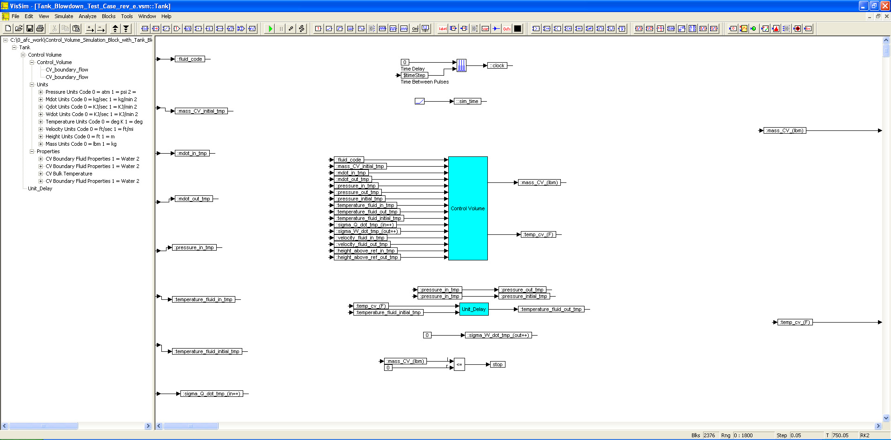

# ========================================
# Control Volume Simulation Block with Tank Blowdown Test Case:
# ========================================

## Control Volume Simulation Block with Tank Blowdown Test Case using VISSIM.

##
## I. Operation: 
### Ia. Control Volume: "./VISSIM/Control_Volume_rev_a.vsm"
### Ib. Tank Blowdown Test Case: "./VISSIM/Tank_Blowdown_Test_Case_rev_e.vsm"

##
## II. Control Volume Block Top Level Diagram:

##
## III. Control Volume Block Interior Sub-System Level Diagram:

##
## IV. Control Volume Boundary Flow Sub-System Level Diagram:

##
## V. Tank Blowdown Test Case Top Level Diagram:

##
## VI. Tank Blowdown Interior Sub-System Level Diagram:

##
## VII. Control Volume Sub-System Level Diagram:

## 
## *Note: 
## 1. Performance Data and Analysis performed using VISSIM, ( https://web.solidthinking.com/vissim-is-now-solidthinking-embed )

